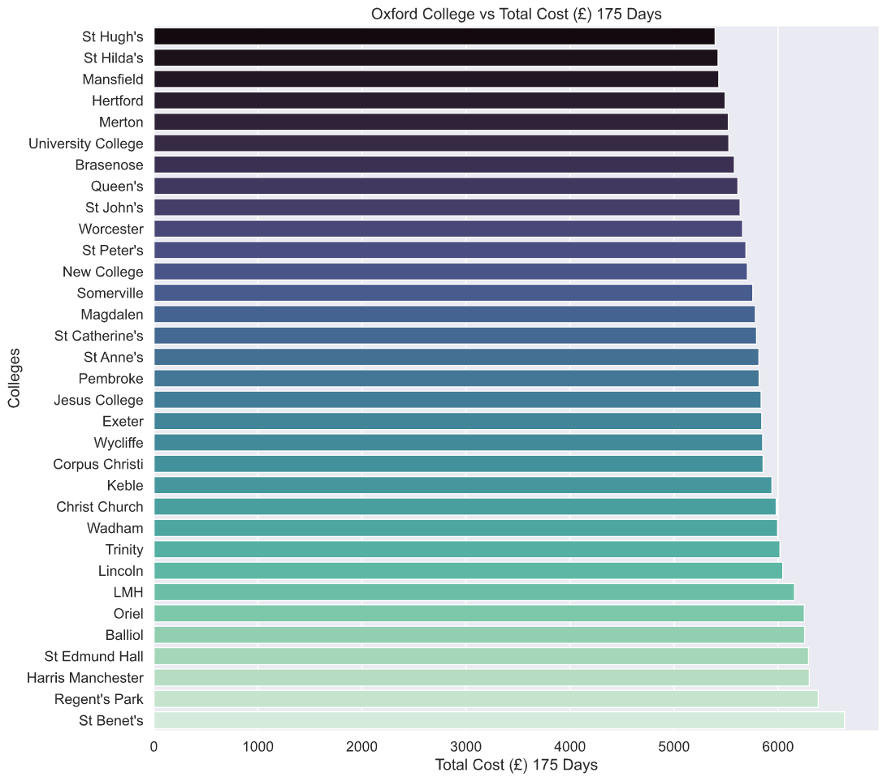

# oxford-colleges

An obvious question to ask when applying to Oxford is: which Oxford college is the cheapest? Although this data is given by Oxford in the following article, [Do I pay to live in my college?](https://www.ox.ac.uk/admissions/undergraduate/colleges/do-I-pay-to-live-in-my-college), this data is sorted based on colleges' name and not cost. This EDA solves this problem.

